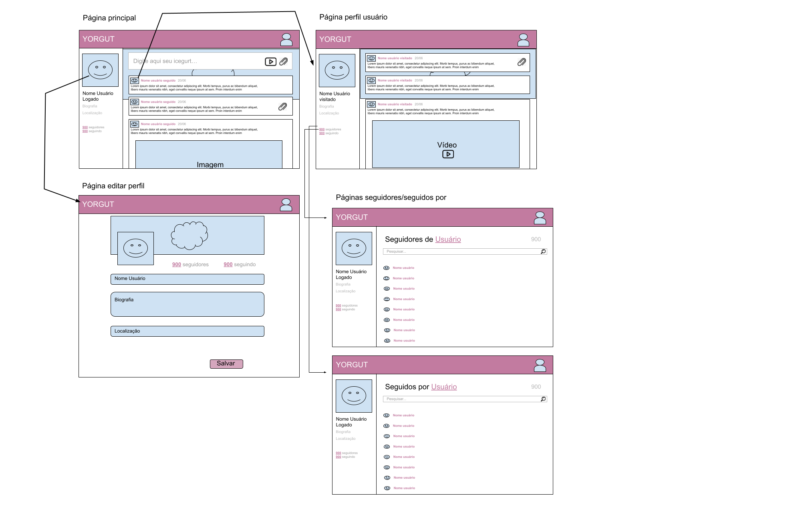

# Yorgut

**Grupo 9**

**Alunos:** Arthur Novaes,	Bernard Menezes, Tiago Araújo, Heloísa

# Descrição do projeto
O projeto consiste em uma nova maneira invadora e única de se comunicar com as pessoas. Algo nunca feito e nunca pensado antes, algo como um rede de socialização entre pessoas na internet. Em que pessoas que não se conhecem podem saber o que você está pensando e você pode saber o que pessoas que você não conhece estão pensando. Uma maneira de (principalmente agora em pandemia) aumentar o distanciamento social, uma vez que não precisaremos mais nos encontrar para nos comunicarmos.

Cada usuário terá sua própria *home page*, que apenas ele tera a possibilidade de edição, e tudo o que ele postar será publicado nesta rede de forma que qualquer pessoa poderá ver todas as publicações de todos que estão na rede. As publicações dos usuários são apelidadas de *Icegurts* e somem depois de 30 dias. Todas as *home pages* dos usuário estárão disponíveis através de um link que qualquer pessoa (desde que esteja logada) possa acessar. 

# Proposta do projeto (especificações técnicas)  
## Features presentes
* Botão de cutucar
* Compartilhamento do pensamento do momento: cada usuário poderá compartilhar com sua rede pensamentos e frases.
    * Poderá ser anexado ao pensamento do momento arquivos e vídeos do **YouTube** 
* Criação de nomes personalizados (com cores e formatos diferentes)
* Criação de depoimentos nas páginas de quem você segue
* Botão de notificações para mostrar quem deixou de seguir, quem começou a seguir quem cutucou etc.
* Easter Eggs (dentro do sistema existem alguns easter eggs escondidos, tente encontrá-los!)
* Para a pesquisa de usuários será utilizado tanto o nome do usuário quanto seu *nickname* (busca fuzzy)
## Gestão de usuários
Para a gestão de usuários serão implementadas as seguintes funcionalidades:
* Receber e-mail ao se cadastrar (4%);
* Fluxo de esqueci minha senha (3%);
* Integração com autenticação pelo *Facebook* e *Gmail* através da API **OAuth** (5%);
* Será possível que o usuário altere informações como nome, foto e outras informações que desejar (3-7%).

## Engenharia de Software
* Integração contínua durante o desenvolvimento (através da plataforma **Heroku** + **GitHub**) (5%);
* Uso *Docker* para isolar ambientes e torná-los facilmente reprodutíveis (5%);

## Integração

* APIs de serviço de hospedagem (comnuicação com S3 para armazenar arquivos blob) (6%);
* Integração com API do *YouTube*. Em cada post do usuário será possível vincular um vídeo do YouTube através do link.
* Upload de arquivos na S3 (AWS)

## BackEnd
* Agendamento de funções do *BackEnd* para atualização das postagens dos usuários (4%);
* Camada de dados RESTful (3%)
* Possibilitar upload de arquivos em postagens (5%);

## FrontEnd
* Todas as páginas responsivas
* Organização em componentes

## Tecnologias utilizadas
Neste tópico serão listadas quais as tecnologias foram escolhidas para o desenvolvimento do sistema
* **FrontEnd**: Para o FrontEnd a framework escolhida foi o **Angular 8**
* **BackEnd**: O BackEnd será desenvolvido em **NodeJS**
* **Servidor**: Tanto o FrontEnd quanto o BackEnd serão hospedados na plataforma em nuvem **Heroku**
* **Banco de Dados**: O Banco de dados utilizado será o **MongoDB** com uma instância hosperada no servidor da **Atlas**

## Protótipo
